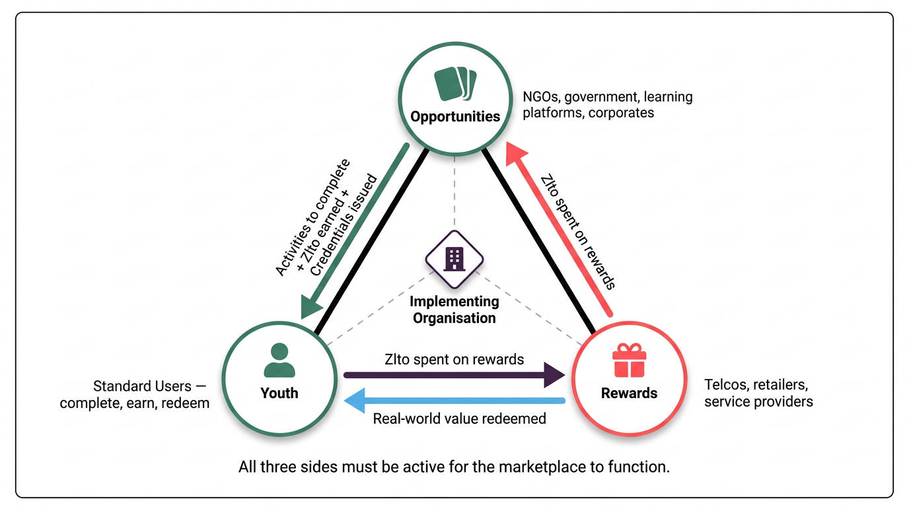

# The Three-Sided Marketplace

*Last updated: February 2026*

Yoma functions as a three-sided marketplace: Opportunities on the supply side, Rewards on the demand side, and Youth as the users in the middle. Understanding this structure is essential for deployment planning — because all three sides must be operational before the marketplace can function, and because it is the implementing organisation's job to build all three simultaneously.

## The Three Sides

### Side 1: Opportunities (Supply)

Opportunity partners — NGOs, government agencies, learning platforms, corporates, and community organisations — list activities that youth can discover and complete. These opportunities span the Grow, Impact, and Thrive dimensions of the framework: learning modules, volunteering tasks, civic activities, employment assignments, and more.

When a youth completes an opportunity and has their submission verified by the partner, they earn Zlto tokens and receive a Verifiable Credential on their YoID. Partners access the platform through an Organisation Admin account, which they use to create listings, review completions, and track participation.

### Side 2: Rewards (Demand)

Reward partners — telcos, retailers, service providers, and educational institutions — provide products and services that youth can redeem using their Zlto balance. Examples include airtime and data vouchers, food discounts, event tickets, and even university scholarship registrations.

All reward configuration goes through the Zlto team (zlto.co), a separate organisation that administers the rewards backend. The implementing organisation recruits and manages relationships with local reward partners, then coordinates with the Zlto team to get listings live on the marketplace. For the full workflow, see [Working with the Zlto Team](../04-rewards/04-04-working-with-the-zloto-team.md).

### Side 3: Youth (Users)

Young people are the users who make the marketplace work. They sign up, complete opportunities, earn Zlto, and spend it on rewards — with every achievement building their YoID. Youth acquisition is an off-platform activity: Yoma has no built-in mechanism to attract users. The implementing organisation is responsible for bringing youth to the platform through marketing, community outreach, school partnerships, ambassador programmes, and events. See [Youth Acquisition Strategy](../05-youth/05-02-youth-acquisition-strategy.md).

## How the Three Sides Connect

The core exchange is straightforward: youth complete opportunities → partners verify and issue Zlto + credentials → youth spend Zlto on rewards → the experience of redeeming a reward and earning a credential motivates further opportunity-seeking.

This loop only works when all three sides are active. An opportunity marketplace with no rewards gives youth nothing to spend their Zlto on. A rewards catalogue with no opportunities gives youth no way to earn. Youth with no opportunities or rewards have no reason to stay. The three sides are interdependent — weakening any one of them weakens the whole ecosystem.

## The Cold-Start Problem

The most common challenge in a new Yoma deployment is the cold-start problem: you need youth to attract partners, rewards to attract youth, and opportunities to give youth something to do — but you have to build all of these before any of them exist.

The practical solution is to sequence the build-out intelligently, not to wait until everything is ready before launching.

**Lead with anchor partners.** Identify two or three committed opportunity partners and one or two reward partners before any youth have registered. These anchors give you something real to show prospective partners and youth from day one — a listing in the opportunity marketplace and at least one reward in the catalogue.

**Launch with a minimum viable ecosystem.** A launch with five strong opportunities and three desirable rewards is more effective than waiting six months for a full catalogue. A lean but functional marketplace demonstrates the model works; youth and partners join a platform that is live, not a platform that is coming soon.

**Match supply and demand carefully.** Don't acquire 500 youth before you have opportunities for them to complete. Conversely, don't recruit 20 opportunity partners before you have any youth to engage with their listings. The sides need to grow in rough proportion to each other.

## When to Bring Youth to Yoma

Once an opportunity is live, there are two distinct ways to drive youth to engage with it — and choosing the right one changes both what you communicate and what a young person experiences when they arrive on the platform.

**Pathway 1: Discovery first — deep link to the opportunity**

Send youth a link that takes them directly to a specific opportunity listing. They land on the opportunity page, read what it involves, see what they will earn, and decide to participate. From there they might click through to an external learning platform, register for an event, or begin an activity.

This pathway works best when youth need the full opportunity information before they can commit — when the activity requires context, preparation, or a decision that a short WhatsApp message cannot convey. Bring youth to the listing when the listing does the persuading.

**Pathway 2: Completion first — verification link**

In this pathway, youth have already done the activity before they come to Yoma. They attended a workshop, completed a course offline, or participated in a community event. The information about what they were doing was communicated through other channels — a WhatsApp group, an in-person briefing, a partner organisation. Once they have completed the activity, they receive a verification link and come to Yoma specifically to claim their credential and Zlto.

If they do not yet have a Yoma account, they create one at this point — motivated by the immediate prospect of a reward. If they already have an account, they go straight to claiming. Driving youth directly to a reward claim is often a more effective call to action than driving them to a discovery page, because the incentive is concrete and immediate.

**Choosing between the two**

The right pathway depends on what the youth already knows and what motivates them at the point of contact. If they need to understand what they are signing up for, bring them to the opportunity listing first. If they have already done the work and just need to claim — or if the reward is the most compelling thing you can put in a message — send them straight to the verification link.

Both pathways can be used within the same deployment, and within the same opportunity. A partner running a workshop might use a deep link to drive pre-registrations, then issue a verification link to all attendees at the end of the session to claim their credentials on the spot.

## Sequencing Considerations

In practice, most implementations find it easier to start with the Opportunities side, because opportunity partners (NGOs, government agencies, learning platforms) tend to have existing programme content that can be adapted into Yoma listings relatively quickly. Reward partners often require longer lead times — procurement, voucher code arrangements, and coordination with the Zlto team.

Start reward partner conversations in parallel with opportunity partner recruitment — even if rewards aren't live on day one of a pilot, having confirmed partners in the pipeline is enough to communicate genuine value to youth.

For a full deployment sequencing guide, see [Deployment Checklist](../02-getting-started/02-01-deployment-checklist.md).

## Related

- [What Is Yoma](01-01-what-is-yoma.md)
- [Key Concepts](01-03-key-concepts.md)
- [Deployment Checklist](../02-getting-started/02-01-deployment-checklist.md)
- [Planning Your Points Economy](../02-getting-started/02-04-planning-your-points-economy.md)

---

*Was this article helpful? If you have suggestions or spot something that needs updating, contact us at [guide@yoma.world](mailto:guide@yoma.world).*
