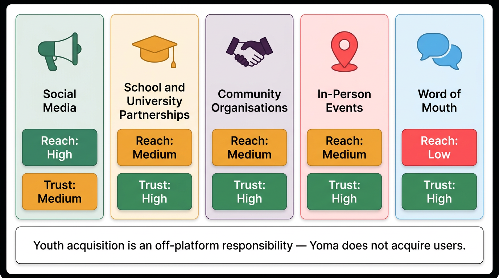

# Youth Acquisition Strategy

*Last updated: February 2026*

Getting young people onto the platform is the implementing organisation's job, not the platform's. Yoma has no built-in user acquisition mechanism — no paid advertising, no algorithmic discovery, no referral system. Youth arrive because your organisation brings them there. This article covers the acquisition channels available, how to combine them into a coherent strategy, and how to set targets that you can actually track.

## Why Acquisition Is Off-Platform

This distinction is important to internalise early. A technically complete platform with zero youth is a marketplace with no buyers. Before launch, the question is not "what does the platform do to attract youth?" but "what will our organisation do to bring youth to the platform?"

The good news: the platform converts well once youth arrive. The onboarding flow is frictionless (under five minutes), and a strong rewards catalogue gives youth a reason to complete their first registration. The challenge is getting them to yoma.world in the first place. See [Youth Onboarding Flow](05-01-youth-onboarding-flow.md) for the mechanics of what happens once they arrive.

## Driving Youth to Your Opportunity

Publishing the listing is only half the job. Once it is live, you need to decide how to bring youth to it — and there are two distinct pathways, each suited to different situations.

### Pathway 1: Deep link to the opportunity

Generate a shareable link that takes youth directly to your opportunity listing. They land on the page, read what the opportunity involves, see what they will earn in Zlto, and decide whether to participate. From there they might click through to an external learning platform, register for an event, or start the activity.

Use this pathway when youth need the full opportunity information before they can commit — when there is more context than fits in a WhatsApp message, or when the activity requires them to understand what is involved before signing up.

### Pathway 2: Verification link direct to claiming

In this pathway, youth have already completed the activity before they come to Yoma at all. They attended a workshop, participated in a community event, or finished a course — and learned about it through a WhatsApp group, an in-person briefing, or the partner organisation itself. You then send them a verification link to claim their credential and Zlto reward.

If a youth does not yet have a Yoma account, they create one when they follow the link — motivated by the immediate prospect of their reward. If they already have an account, they go straight to claiming. Either way, the call to action is simpler and more direct: "You did the work — here is your reward."

Use this pathway when the reward is the most compelling hook, or when the activity already happened outside the platform and youth do not need any further information from Yoma. Driving someone straight to a claim is often more effective than driving them to a discovery page.

### Combining both in the same opportunity

The two pathways are not mutually exclusive. A partner running a workshop might use a deep link in advance to drive registrations — giving undecided youth the full information to commit — and then issue a verification link to all attendees at the end of the session so they can claim on the spot. The pre-event communication uses one pathway; the post-event follow-up uses the other.

## Acquisition Channels

### Social Media

Social media is typically the highest-volume channel for youth-facing campaigns. In most markets, a combination of Instagram, TikTok, Facebook, and WhatsApp broadcast covers the majority of the 13–25 demographic. Short video content showing real rewards — airtime, data bundles, local vouchers — outperforms text-heavy posts consistently.

Platform-specific approaches: Instagram and TikTok work best with short video testimonials and ambassador takeovers; Facebook suits longer-form posts with sign-up links and event announcements; WhatsApp broadcast lists are effective for direct outreach to existing community contacts.

### School and University Partnerships

Educational institutions offer structured access to large cohorts of youth in a single engagement. A school visit or university orientation session can produce 50–200 sign-ups in a morning. This channel requires relationship investment — see [Recruiting Opportunity Partners](../03-opportunities/03-02-recruiting-opportunity-partners.md) for the process of bringing educational institutions on as opportunity partners, which often runs in parallel with using them as acquisition channels.

### Community Organisations

NGOs, youth clubs, faith communities, and sports associations have existing trust relationships with young people. A referral from a community leader converts at a higher rate than a cold social media post. Prioritise organisations whose members overlap with your target youth demographic, and coordinate acquisition outreach with any opportunities you're listing in partnership with them.

### In-Person Events and Activations

Launch events, community days, and pop-up activations are effective for generating concentrated sign-ups in a short window. They work particularly well when devices are available on-site (or youth are encouraged to bring their own), the registration process is demonstrated live, and an immediately available low-effort opportunity is open for completion that day.

### Word of Mouth

Peer referral is consistently the most trusted acquisition channel — and the hardest to engineer. It emerges naturally when youth have a genuinely positive early experience: earning Zlto and redeeming a desirable reward. You can accelerate this with a structured ambassador programme. See [Ambassador Programmes](05-03-ambassador-programmes.md) for the mechanics.

## The Role of Incentives in Early Acquisition

Youth will sign up when they can see, clearly and immediately, what they stand to gain. In the early phase of a deployment, this means making the value proposition concrete before asking for commitment.

**Make rewards visible before sign-up.** Ensure your marketing content features the actual rewards available — airtime, data bundles, food vouchers, event tickets. Abstract messaging about "building your future" is harder to act on than a specific reward youth can imagine redeeming.

**Provide an on-ramp opportunity.** Have at least one low-effort, immediately available opportunity live on launch day — something completable in under 30 minutes with a clear output. This gives newly registered youth a route to their first Zlto earnings and their first Verifiable Credential before they leave the platform. A youth who earns Zlto in their first session is far more likely to return.

**Connect completion to redemption.** Show the maths explicitly in your communications: "Complete [opportunity name] and earn [X] Zlto — enough to redeem [specific reward]." Making the token-to-reward calculation concrete removes uncertainty and gives undecided youth a reason to commit.

## Building a Multi-Channel Strategy

No single channel is sufficient on its own. A multi-channel approach is more resilient — if one underperforms, others compensate — and it reaches youth who are active on different platforms or in different contexts.

A practical structure for most deployments:

1. **Anchor channel** — your primary volume driver (typically social media or school partnerships, depending on your market and existing relationships)
2. **Activation events** — one or more in-person events to generate concentrated early sign-up volume
3. **Ambassador layer** — peer referral infrastructure that builds organically over time
4. **Ongoing comms** — regular social media and direct messaging to maintain visibility beyond launch

See [Marketing and Communications](05-04-marketing-and-communications.md) for content strategy and messaging guidance across these channels.

## Setting Acquisition Targets

Set targets before launch and track them weekly. The key metrics to monitor are: number of YoID accounts created by a specific date (registration target); percentage of registered youth who complete at least one opportunity within a defined timeframe (activation rate — a proxy for engagement quality, not just sign-up volume); and percentage who complete a second opportunity within 30 days (return rate).

Acquisition targets should be grounded in your deployment's capacity on the opportunity side. If you have ten opportunities listed from five partners, you can support a smaller initial cohort well. Launching with 500 youth and five opportunities means most youth will find nothing to do. Match acquisition pace to opportunity supply.

> ℹ️ **Note:** Acquisition numbers (YoID registrations) are visible in the implementing organisation's dashboard. See [Measuring Youth Engagement](05-07-measuring-youth-engagement.md) for what is and isn't currently trackable from the platform.

## Related

- [Youth Onboarding Flow](05-01-youth-onboarding-flow.md)
- [Ambassador Programmes](05-03-ambassador-programmes.md)
- [Marketing and Communications](05-04-marketing-and-communications.md)
- [Measuring Youth Engagement](05-07-measuring-youth-engagement.md)

---

*Was this article helpful? If you have suggestions or spot something that needs updating, contact us at [guide@yoma.world](mailto:guide@yoma.world).*
